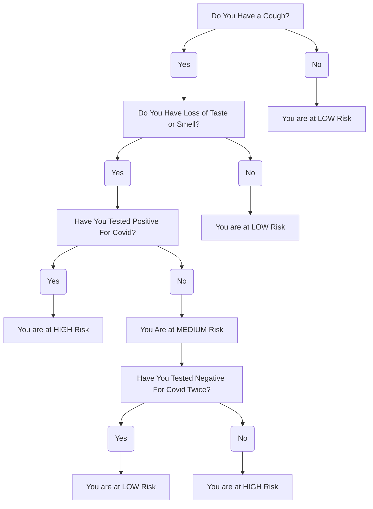

## Decision Tree for ROBAI240 Discussion 8
## Risk of Having Covid

```mermaid
flowchart TD
    
    A[Do You Have a Cough?] --> Ay(Yes) --> B[Do You Have Loss of Taste or Smell?] --> By(Yes) --> C[Have You Tested Positive For Covid?] --> Cy(Yes) --> CyA[You are at HIGH Risk];
    A --> An(No) --> AnA[You are at LOW Risk];
    C --> Cn(No) --> CnA[You Are at MEDIUM Risk];
    B --> Bn(No) --> BnA[You are at LOW Risk];
    
    CnA --> D[Have You Tested Negative For Covid Twice?] --> Dy(Yes) --> DyA[You are at LOW Risk];
    D --> Dn(No) --> DnA[You are at HIGH Risk];
```
